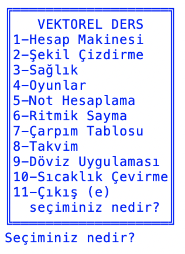
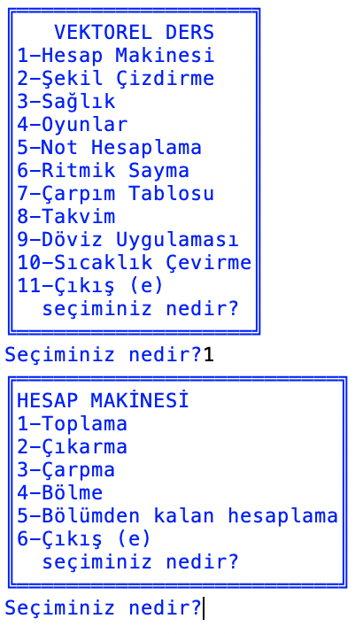
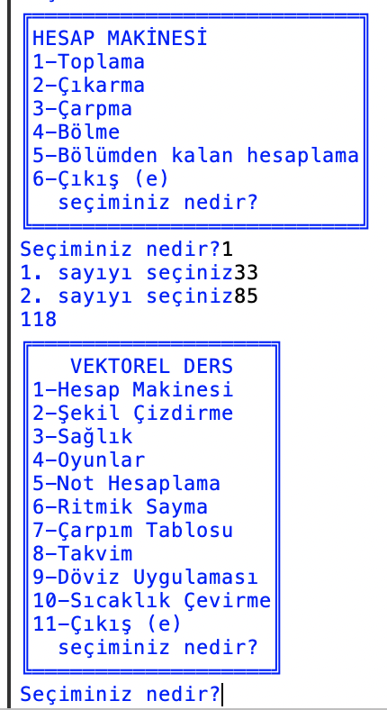

# CONSOLE UYGULAMASI
## Yaptığım ilk proje

Uygulamayı açtığımızda bu ekran bizi karşılamakta.
 
İstediğimiz uygulamaya başındaki numarayı yazarak yönlendiriliyoruz.
 

Örneğin 1 numara basarak hesap makinesine ulaşabiliyoruz!
 

Karşımıza çıkan hesap makinesinden de istediğimiz işlemi numaralarına göre seçip istediğimiz işlemi yaptırabiliriz.